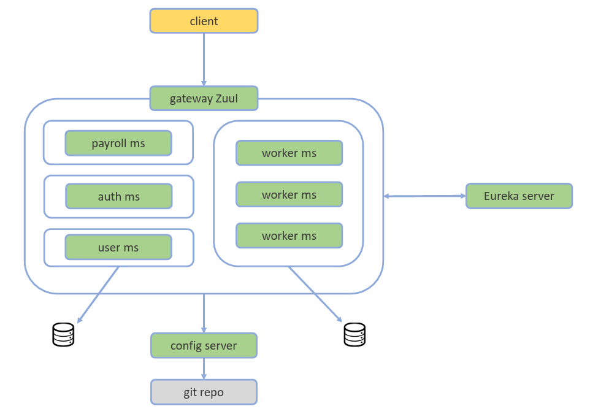
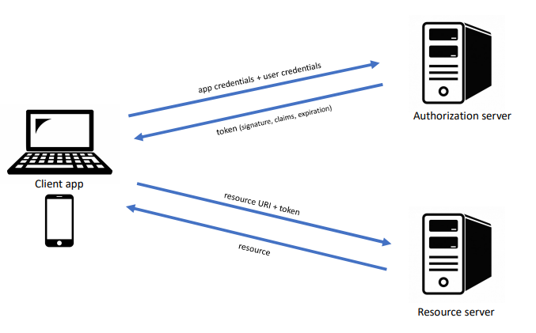
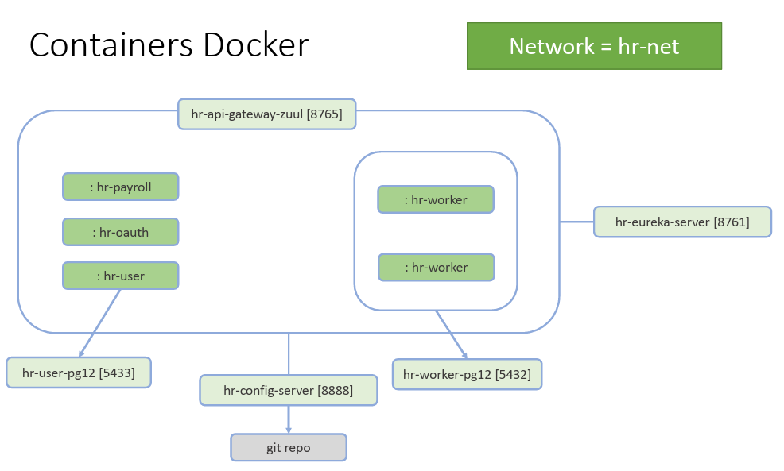

# Curso Microsserviços Java com Spring Boot e Spring Cloud 

Repositório contendo os códigos desenvolvidos durante o curso Microsserviços Java com Spring Boot e Spring Cloud da [Udemy](https://www.udemy.com/course/microsservicos-java-spring-cloud/).

## Checklist baixar e executar projeto pronto

- JDK 11, Spring Boot 2.3.4, variáveis PATH e JAVA_HOME
- Configurar IDE para pegar Java 11
- Importar projetos na IDE
- Configurar credenciais do config server
    - Modelo do curso: https://github.com/acenelio/ms-course-configs
- Preparar Postman (collection e environment)
- Subir projetos em ordem:
    - Config server
    - Eureka server
    - Outros

## O que foi implementado/estudado

Arquitetura implementada:

- Fase 1:
    - Criar projetos Spring Boot
    - Configurar arquivos pom.xml 
    - Criar as classes e estruturas dos microserviços
    - Comunicar os microserviços via REST 
    
- Fase 2:
    - Configurar os clientes e servidor Eureka
    - Configurar o Hystrix para tolerância a falhas
    - Configurar a API gateway Zuul
    - Configurar as portas aleatórias dos microserviços
- Fase 3:
    - Configurar o servidor de configuração via Github privado e público
    - Configurar de forma centralizada
    - Configurar clientes do servidor de configuração
    - Configurar Actuator para atualizar servidor em runtime
- Fase 4:
    - Autenticação e Autorização com Oauth e JWT
    - Configurar Roles dos usuários e associação entre tabelas
    - Carga inicial da base de dados (seeding)
    - Configurar Repositórios, Resource e configurações zuul
    - Configurar clientes Feign
    - Configurar segurança no servidor de configuração

- Fase 5:
    - Passar os microserviços para containeres Dockers
    - Escalar instâncias de um container
    - Configurar banco de dados Postgres
    

## Execução dos microserviçoes

Antes de iniciar os microservições é necessário subir os bancos de dados Postgres para o Worker e User. Após, rodar os projetos na seguinte ordem:

1. hr-config-server
2. hr-eureka-server
3. restante dos serviços

Execução dos serviços utilizando o docker está descrito na branch **docker**

